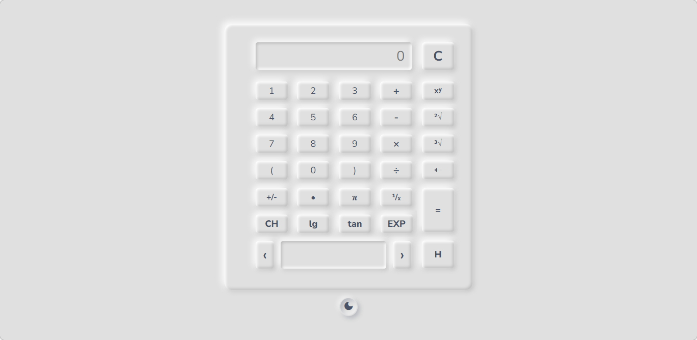
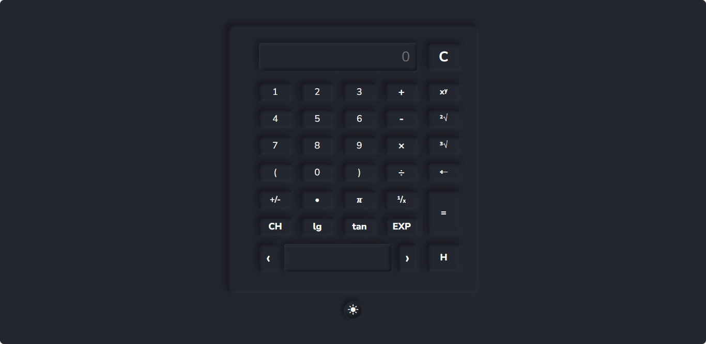

# JS Calculator By Amiru2007

Scientific calculator powered by JavaScript. The calculator includes number buttons, a clear button, 5 operator buttons such as "Addition, Subtraction, Multiplication, Division and Exponentiation", a backspace button, a dot button and a display to show the operations. I have used `input` tags to get the values into the display.

### Screenshots

In addition, this calculator also has 5 other scientific operations. This calculator has Clear, Backspace, History, Percentage and π buttons. You can find a number's square root and cube root using this calculator. I am just working on this, I'll upload a youtube video soon.

### Follow me for more projects...

Codepen &nbsp;-&nbsp;&nbsp; https://codepen.io/Amiru-Weerathunga

GitHub &nbsp;&nbsp;&nbsp;&nbsp;-&nbsp;&nbsp; https://github.com/Amiru2007

Medium &nbsp;&nbsp;-&nbsp;&nbsp; https://medium.com/@amiru.upek.weerathunga

Dev &nbsp;&nbsp;&nbsp;&nbsp;&nbsp;&nbsp;&nbsp;&nbsp;&nbsp;-&nbsp;&nbsp; https://dev.to/amiruweerathunga
